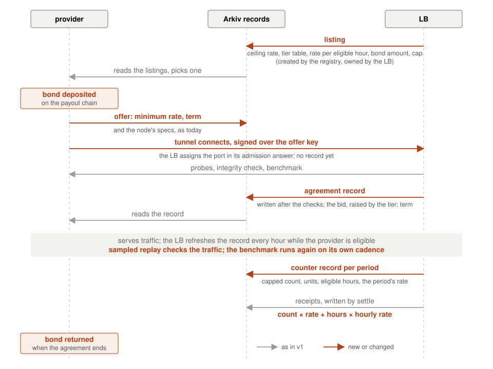

# The marketplace beyond v1 — pricing, payment, several LBs

**Scope:** a design note on what an open marketplace for RPC nodes
needs that v1 does not have, as a later version would build it. What
v1 fixed and why, what each fixed choice costs, and the steps from
here in the order they would be worth taking. Companion to
[MARKETPLACE.md](MARKETPLACE.md), which says how v1 works, to
[ENTITIES.md](ENTITIES.md), which specifies the records, and to
[MISBEHAVING_NODES.md](MISBEHAVING_NODES.md), which covers providers
that serve wrong data. Vocabulary as in those notes: the whole service
is the LB; a *provider* is a community node under agreement with it;
the *payout chain* is where GLM is transferred, and the *records* live
on the Arkiv chain the LB serves.

## What v1 fixed

Each of these was a choice, made to fit one LB and a fixed deadline.
Each is named here with its reason, because the sections that follow
reopen them one at a time.

- **One LB.** The provider tooling ships one LB address, and every
  trusted read filters on it. There is no way to add a second LB
  without a tooling release.
- **The LB sets the price.** The listing carries one rate; an offer
  carries none. A provider that does not like the rate does not post.
  Discovery, not negotiation.
- **Binary acceptance.** An offer is accepted or it expires. Nothing
  passes between the two sides but the offer and the agreement record.
- **An agreement has no end.** It lives while the hourly refresh
  extends it, at the rate it was accepted at.
- **Every request is worth the same.** The count is of answers relayed,
  whatever the method, and the pay is count times rate.
- **Every eligible provider gets the same share.** Round robin, no
  weight.
- **Nothing is paid for being there.** A provider with no traffic earns
  nothing, however good its node.
- **A slot costs nothing.** Posting an offer only requires gas; an
  agreement holds a slot for a day whether the provider connects or
  not.
- **The provider takes the LB's count on trust.** The counter record
  names the blocks it covers, so a provider can compare with its own
  logs, and that is all.

Every change below is a change to what is written on the chain and who
reads it. The creator rule, that every trusted read filters on the
writer's address, stays in every one of them.

## Pricing and negotiation

The listing's single rate was chosen because a negotiation needs a
selection rule, and a selection rule is something to game. What v1
gives up is price discovery: an operator cannot say what running its
node costs, and the LB cannot learn it.

### Offers that carry a rate

The smallest step is offers that carry a rate, with the listing's
rate as the most the LB pays. The records already allow it: an offer
has a payload, and the agreement record already copies the rate it was
accepted at, so nothing changes for the counter records or settle. What
changes is one rule in discovery: cheapest first instead of oldest
first, ties by age. That is a reverse auction with the listing's rate as
the ceiling, and it needs no new record and no new write.
[Akash](https://akash.network/) runs its compute market this way: an
order names the most the buyer pays, providers bid under it, the
lowest qualifying bid wins by default, and the buyer may take any bid,
weighing a provider's uptime history or region instead.

The cost is that the rule can be gamed. An operator can underbid to
take a slot and then serve badly, since the slot is what it wanted; the
answer is the same as for every provider that serves badly, the health
and integrity gates, which do not look at the rate. An operator can
underbid with many identities to hold every slot cheaply; that is the
[identities
problem](MISBEHAVING_NODES.md#one-operator-several-identities), and a
bond (below) is its answer.
And a rate once accepted is fixed for the agreement; the LB does not
renegotiate a live agreement, and should not, since the agreement
record is what the provider signed up to.

### A term

That makes a term worth having, which v1 has not: an agreement in
v1 has no end, it lives while the refresh extends it, so its rate
holds forever, and a provider that wants a different rate, or wants to
leave, has one way out, going ineligible for three days until its
record expires. With a term, the offer says how long the provider
commits to serve, the listing caps it, the agreement record carries
the end block, and the refresh never extends past it. The rate is then
fixed for a known time, and renewal is where both sides re-bid, where
the LB re-vets, and where a bond is returned or renewed. The cost is
churn per term: a new agreement is a new record, so a new token and a
tunnel restart on the provider's side, unless the renewal offer points
at the current agreement and the admission accepts the old token until
the new record lands.

### Counter-offers

Counter-offers would be a terms record written by the LB between
the offer and the acceptance, for the provider to accept or decline.
The full shape is the [Golem
market](https://docs.golem.network/docs/creators/common/requestor-provider-interaction):
a demand and an offer each carry properties and constraints, they
match when each side's properties satisfy the other's constraints, and
proposal and counter-proposal rounds follow, each side editing only
its half, until an agreement. That market needs the rounds because
every demand is different, a workload with its own requirements. Here
the LB's demand is the same for every provider, serve this chain at
this rate, and it is public in the listing. The rounds would add a
write, a record kind, a state the LB has to time out, and a poll on
the provider's side, and what they would carry, "not at that rate, but
at this one", the ceiling already says. The rounds are not worth their
state.

### Selection beyond the rate

Selecting by rate alone also ignores what kind of node is offered. The
listing could name what it pays more for: an archive node, a node in a
region
the LB has few of, a node above a benchmarked capacity. Each of these is
a second selection input, and each has to be checked, not read from the
offer's self-reported specs. The benchmark section says how one of them
would be. [Lava](https://www.lavanet.xyz/) selects on inputs like
these and not on price: its price is fixed by subscription, and
providers are paired to consumers each epoch by stake, region and a
measured quality score (latency, availability, sync). A working RPC
market runs with no price negotiation at all.

## Metering and payment

A provider is paid the number of answers it served multiplied by the
rate. Four things are wrong with that as a market, in the order they
would matter.

### A provider can pay itself

The public endpoint takes requests from anyone, so a provider that
sends its own traffic is paid for the share that reaches its own node,
and every answer is honest
([MARKETPLACE.md](MARKETPLACE.md#counting)). The rate limiter in front
of the LB bounds the pace per client address; a **payout cap per
agreement per settlement period** bounds the gain whatever the number
of addresses. This is the first change in the order at the end,
because it is small and it closes a hole in the payment itself. A
budget per period for the whole LB would bound the total the same
way, shared between the providers in proportion to their counts; the
cap per agreement is simpler and bounds each provider on its own.

### Every method pays the same

An `eth_chainId` and a full page of `arkiv_query` are one count each.
The count rewards the provider that gets the cheap calls, by luck of
the round robin, and the LB cannot steer heavy calls to the nodes that
can take them. Method weights have two downsides: they need a weight
table agreed on both sides, and the count becomes a sum of weighted
units that a provider can no longer check against its request log
with a line count. The shape, when it is worth it: a table of weights
in the listing (so it is public and fixed per agreement like the
rate), the count in units, and the counter record carrying both the
request count and the unit count so the provider can still check the
first.

For the `arkiv_*` methods the weight need not be a table. The node
already prices a query at the protocol level, by what it scanned,
looked up and returned, and Golem's stated direction is that a query's
answer will report the units it cost, with providers eventually paid
in those units. The Proxy's count would then add the reported cost
instead of one, and the listing's rate would be per unit. Two things
come with it: the `eth_*` methods report no cost, so they still need a
static table beside the reported units; and the units are reported by
the provider being paid for them, so a provider inflating its costs
is one more lie for the integrity checks to look for, by comparing
the reported cost with the reference's for the same query. Pocket and
Lava both pay providers in compute units set per method on chain.

### A node with no traffic earns nothing

A new provider in a pool with little traffic may serve a handful of
requests a day, and an operator who keeps a synced node for that has
no reason to. An **availability
component**, a fixed amount per hour eligible, pays for being there,
and the LB already knows the number: the refresh marks the eligible
providers every hour, and the count of refreshes a record received is
its eligible hours. It is a second number in the counter record and a
second term in settle's sum. It also makes the [identities
gap](MISBEHAVING_NODES.md#one-operator-several-identities) cost more:
with pay per eligible hour, a second identity on one node is paid
twice for being there, which is the strongest reason for the bond
below.

### The provider has only the LB's word for the count

The LB counts, writes, and pays; the provider can compare the
block-stamped count with its own log and has no way to dispute a
difference.

The networks that solve this all do it the same way: the party that
pays signs every request it sends, the provider keeps the signed
requests, and the provider is paid for what it can show, not for what
the payer counted. They differ in how much of that reaches the chain.
In [Lava](https://www.lavanet.xyz/) the provider submits the signed
requests as its claim. In [Pocket](https://pocket.network/) the
provider keeps only a random sample of them, commits a summary of the
sample on chain, and is asked to show one of them chosen at random.
In [Livepeer](https://livepeer.org/) each signed request is a lottery
ticket worth a small fixed amount on average, and only the winning
tickets are cashed on chain.

Here the payer is the LB, so the LB would sign every request it
forwards, the provider's tooling would keep the signed requests, and
settle would pay the count the provider shows rather than the count
the LB wrote, in Lava's shape at the least. That is a different
payment system, not a change to this one. Short of it, the provider's tooling can publish
its own count for the period beside the LB's, which makes a
disagreement a public fact and enforces nothing; with several LBs it
at least shows which LB undercounts.

## Benchmarking

A benchmark asks a provider for a lot of work in a short time and
records how it did. In a market it is worth three things: a selection
input that is checked rather than self-reported; a rate tier, so a node
that can take more is paid more; and the one mechanism that makes
[relaying to another node](MISBEHAVING_NODES.md#the-proxying-provider)
pointless, since a relay scores no higher than its upstream. Lava's
quality score is the precedent for the first: measured by the
consumers' own requests, and an input to who is paired with whom the
next epoch.

**What it would measure:** throughput, as requests answered in a burst of a
fixed size; latency under that load; and depth, whether the node answers
at a block range far below the head, which is what an archive node is.
The burst reads a random block range or a random key range, so the
answers are deterministic and a sample of them can be checked against
the reference afterwards, or hashed and compared across the fleet when
several providers are measured at once.

**Where it would run:** in a process of its own on the LB host, not in the
LB. A tunneled provider is a loopback port on that host, bound by the
tunnel server, so a second process can send to the port directly,
taking the port of each provider from the LB's nodes view. The burst
then never passes through the Proxy: it competes with no client
traffic for the LB's runtime, and the LB counts none of it, so
benchmark traffic is never paid. The process runs on its own cadence,
one provider at a time, and writes its result to the chain through the
writer sidecar as a record keyed by the provider's address, which the
LB reads back the way it reads every other record.

**How the result would reach the rate:** a benchmark needs the tunnel,
and in v1 the tunnel comes after acceptance, because the provider
signs the agreement id to be admitted and reads its port from the
agreement record. That order can be turned round. The provider signs
its offer key instead and connects on any port; the tunnel server's
admission hook lets the LB answer with the port it assigns, so no
record is needed before the tunnel is up. The LB then probes, runs
the integrity check and the benchmark, and only then writes the
agreement record, with the rate the benchmark earned. One write, after
the node has proved itself, and a provider that never connects or
never syncs costs the LB nothing on chain. What an unvetted tunnel
costs is a port, so a tunnel that has not passed is dropped after
minutes, not a day, and the trial tunnels get a port range of their
own.

The provider has no say in the tier, so the tier must never work
against it: the offer's rate is the least the provider accepts per
call, the LB pays at least that, and a tier can only raise it. The
listing publishes the tier table, so a provider knows beforehand what
a tier adds. A provider that hoped for a tier it did not earn still
gets the rate it asked for, and leaves at the term's end if that is
not enough.

After acceptance the rate can still move. The counter record already
copies the rate for its period, so a benchmark run during one period
can set the tier for the next without touching the agreement record,
and the offer's rate stays the floor. And the result record outlives the
agreement, so discovery can read it when the provider comes back: an
offer from a provider with a known capacity is ranked by price per
unit of capacity where a newcomer's is ranked by price alone.

**What it costs:** load on the provider, by design; the reference's quota
when the sample is checked there; and the bursts are recognisable, so a
provider can answer bursts from a better node than it serves clients
from, which is the [traffic-lying
gap](MISBEHAVING_NODES.md#the-traffic-lying-provider-and-sampled-replay)
again.
The sampled replay of client traffic is the check against that, not the
benchmark.

## Slots and a bond

A slot is held from acceptance and costs the provider nothing beyond
an offer's gas. An operator with as many keys as the LB has slots can
hold every one of them without connecting a node, every day, for the
price of the offers.

Acceptance after the tunnel, as the benchmark section describes,
removes the cheapest form of this: the record is written once a node
has answered the probes and the integrity check, so a slot cannot be
held without a node, and a key that never connects costs the LB
nothing. It does not remove the form with a node: one node can serve
several tunnels, one per key, and each passes the checks, which is the
[identities
gap](MISBEHAVING_NODES.md#one-operator-several-identities) and what
the bond is for.

A **bond** makes a slot cost something: GLM locked for the life of the
agreement, returned at its end. The simplest shape has no slashing at
all. The provider
deposits into a contract on the payout chain naming its provider key;
the LB reads the deposit before accepting an offer, which is one read on
the payout chain where today there is none; the contract releases the
deposit when the agreement's record has expired, which the contract
cannot see, so release is by the LB's signature or after a fixed time
past the agreement's last possible end. With no slashing there is
nothing to dispute: the bond is a capital cost per slot and nothing
else. That alone puts a price on squatting and on a second identity,
since each slot now ties up money that earns nothing while it is held.

A bond that can be lost is the second step and the expensive one.
There is no loss condition the contract can check on its own: every
fact on the chain about what a provider did, whether it connected,
whether its record was extended, was written by the LB, so a bond
lost on any of them is a bond lost on the LB's word. Losing it for
serving wrong data needs the verdict to be more than that word, which
is the [signed-answer
evidence](MISBEHAVING_NODES.md#a-reputation-mechanism), and it needs
an arbiter, a key that can tell the contract to release to the LB
rather than to the provider. At first that key is the network's
operator; a jury of other providers, as Lava has, is a later shape.
Until the evidence and the arbiter exist, a bond that is held and
returned is all that is worth building.

## Several LBs

Several LBs are the stated direction: one per region, or per price
bracket, each with its own providers. Two things stand in the way in
v1: the tooling ships one LB address, and settle pays for one LB.

### The registry

The registry is the first step, and a small one. A cold network-level
key whose address the tooling ships instead of the
LB's. It creates every LB listing and transfers the entity to the LB, so
a listing is trusted by its creator, the registry, and the LB's address
is read as the listing's owner. Providers see every listing under the
registry and choose one, so the listing gains what there is to choose
by: a name, the chain it serves, a region, beside the rate and the
free slots. A node may hold an agreement with each LB at once, through
one tunnel client per agreement, where the tooling runs one today.
Settle learns the LBs it pays for the same way, from the
owners of the registry's listings, and pays each LB's closed counter
records from that LB's balance, which means settle holds one key per LB
or each LB runs its own settle. The switch in code is small: the tooling
reads the LB address off the listing's owner instead of its creator in
one place; the LB's startup query adds the owner condition under the
registry's creator; settle takes its list of LBs from the listings; and
a registry script creates and transfers a listing. Retiring an LB is a
revocation record by the registry, which the tooling reads before
trusting a listing.

### Self-listing

What the registry does not do is make LBs permissionless: the registry
key decides which LBs exist. Self-listing, where anyone runs an LB and
lists it, is the step after, and it changes who the adversary is. A
provider under agreement with an LB it does not know trusts it to count
honestly and to pay, and nothing in the records makes it. Pocket and
Lava both have permissionless gateways and solve this the same way:
the chain holds the payer's money before the work, a prepaid
subscription or a staked application, and pays the providers from it,
so the gateway never holds what the providers are owed. Here that is
an LB's GLM in escrow on the payout chain, with settle paying out of
the escrow rather than from a balance the LB controls, and an LB that
stops funding the escrow is one that providers stop posting offers to.
The escrow makes the payout trustless; what the provider still takes
on trust is the count, which is the metering section's problem. A
provider's tooling would then rank LBs the way the LB ranks providers.
That is a symmetric market, and it is twice the work of this one; the
registry with a chosen set of LBs covers the stated direction.

### A provider's history across LBs

The counter records, the receipts, the verdicts and the benchmark
results are per LB, so with several LBs a provider's whole history
exists only on the chain, under several creators. Anything that wants
it, a reputation, a dashboard, a second LB deciding whether to accept
the provider, reads it from there; which is why each of those results
is a chain record in this note and not a number in one LB's memory.

## The flow with all of it

The sections above each reopen one choice. Taken together they are
one flow, in the shape of the v1 one in MARKETPLACE.md:

Not every piece needs the others. The payout cap, the rate bid, the
availability component, the method units and the registry each stand
alone on v1 as it is. Acceptance after the tunnel changes the
admission token and the order of the writes, and the benchmark's rate
at acceptance depends on it. The bond needs a contract on the payout
chain and nothing else here. The tier per period needs the benchmark.
What ties them is the records: every piece is one more field
in the listing, the offer, the agreement record or the counter
record, read by the party that already reads that record.

## What the code would change first

In the order the steps are worth taking, each small enough to be one
change:

1. **A payout cap per agreement per settlement period.** One config
   value and a check in the flush. Closes the self-dealing hole in the
   payment, whatever the rate limiter in front of the LB does.
2. **Offers that carry a rate, cheapest first.** The offer payload
   gains a field, the listing's rate becomes the ceiling, and discovery
   sorts by rate before age. No new record.
3. **A term on the agreement.** An end block in the offer and the
   agreement record, a cap in the listing, and a refresh that stops
   there. Gives both sides a renewal point.
4. **Acceptance after the tunnel.** The provider signs its offer key,
   the admission hook assigns the port, and the agreement record is
   written once the probes and the integrity check pass. Removes the
   slot a never-connecting provider holds, and the gas it costs.
5. **The registry as trust root.** The contained switch above, with the
   registry script; the tooling, the LB's startup query and settle
   each change in one place. Lets a second LB exist without a tooling
   release.
6. **An availability component in the pay.** Eligible hours counted in
   the counter record from the refreshes, and a second term in settle.
   Pays for a node being there, which is what a network with little
   traffic needs first.
7. **A bond held for the agreement's life.** The provider locks GLM in
   a contract on the payout chain; the LB checks the deposit before
   accepting and signs its release when the agreement ends. The bond
   is never lost on an integrity verdict. It makes a second identity
   cost money.
8. **Method weights.** The count in units beside the request count:
   the cost a query's answer reports for `arkiv_*`, once the node
   reports it, and a table in the listing for the rest.
9. **Benchmarking.** A process of its own on the LB host, sending to
   the tunnel ports directly, its result a record per provider on the
   chain. A measurement only at first; paying by it, the rate at
   acceptance and a tier per settlement period, comes once the
   sampled replay runs beside it, since replay is what catches a
   provider that answers bursts from a better node than its clients
   get.

What this note does not propose at any step: permissionless LBs. The
registry with a chosen set of LBs covers the stated direction; the
escrow and the symmetric market that self-listing needs are a second
project.
