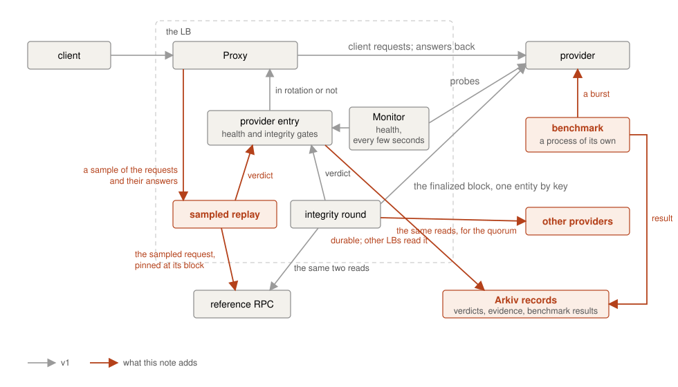

# Misbehaving nodes — the problem analysis, and what v1 can do

**Scope:** a design note on the full protection against misbehaving or
malicious providers, as a later version would build it. What a paid,
permissionless provider can do wrong, what the integrity checks of v1
catch ([INTEGRITY.md](INTEGRITY.md)), what they do not, and the steps
from here, in the order they would be worth taking. Companion to
[MARKETPLACE.md](MARKETPLACE.md), which says how providers join, and to
[PROXY.md](PROXY.md), which says how health works, and to
[MARKETPLACE_FUTURE.md](MARKETPLACE_FUTURE.md), which covers the
market side: pricing, payment, the bond, several LBs. Vocabulary as in
those notes: the *reference* is the official Arkiv RPC endpoint the LB
is configured with; an *integrity round* is one pass of the integrity
checks over the providers.

## The adversary

A provider is anyone with an Arkiv key, a node, and a tunnel. Nobody
vets them, and they are paid per request served. Other load balancers
balance over nodes their operator chose and trusts, so their health
checks only ask whether a node is up. Here a node that is up may be
lying, because lying pays.

What a provider controls: every byte its node answers, to the LB's
checks and to clients alike; how many identities it posts offers under;
when its tunnel is up. What it does not control: the chain, which the
reference reads for the LB; the LB's own view of what it served; and
other providers.

What it can gain:

- **Payment for answers it did not compute.** Serving a cheap wrong
  answer, or a stale one, costs less than running a synced node. Per
  request the gain is small; the point is that a node that does no work
  earns the same as one that does.
- **A share of traffic it is not entitled to.** More slots than nodes,
  through more identities than nodes.
- **Payment for traffic it generates.** A provider can send requests
  to the LB's public endpoint itself, for free, and is paid for the
  share of them that the LB routes to its own node.
- **Harm to the clients**, if that is the goal rather than money: a
  client that reads a wrong entity, or a wrong transaction receipt.

One fact runs through this note: the LB pays for answers, so it can only
judge answers. Whether there is a node behind the answers, and whose
node it is, are other questions, with weaker tools.

## What v1 catches

An integrity round compares two reads per provider with the reference:

1. the block at the finalized height (a fixed set of block fields is
   compared);
2. one random entity read by key.

A difference that survives a second look is a divergence, and a
confirmed divergence takes the provider out of rotation until a later
integrity round passes it. The mechanism is in
[INTEGRITY.md](INTEGRITY.md). What it means against the adversary:

- **A node on another chain, or on a fork,** fails the block check at
  once, since every honest node has the same finalized block.
- **A node serving wrong entities,** whether altered or invented, fails
  the entity check when the sampled key lands on one. One key per
  integrity round means a node lying about one entity in a thousand is
  caught slowly; one lying about all of them is caught at the first
  integrity round.
- **A node that makes itself stale to avoid being judged.** Stale is not
  lying, and a node that has not got the finalized block yet is left to
  the lag path. Two edge cases where a node is still treated as lying:
  - a node that reports a current head and then has no block at a
    height below it;
  - a node that answers an entity far behind its own head.
- **A brief disagreement at the tip** is not a verdict. The second look
  after a wait lets a reorganisation of the tip resolve; only a
  difference that stays for the confirmation check is a divergence.

## What v1 does not catch

Each of these is a real gap. Each comes with why it was left open, so
the next step can be chosen knowing its cost.

- **A wrong answer to a query, as opposed to a wrong entity.** The
  entity check reads by key. Which entities match given filters, and every
  other method a client calls, is never compared. The one that matters
  most is the transaction receipt: the SDK sends its writes through the
  LB and then polls the receipt through it, so a provider lying about
  receipts breaks clients' writes while passing every check.
- **A provider that lies to clients and not to the checks.** The checks
  are made to look like client traffic, and the entity check is an
  ordinary query by key with no block parameter, exactly as a client
  sends one, under a random request id like any client's. But a
  provider can still tell them apart in the aggregate: the checks are
  rare, regular, and shaped alike, where client traffic is not. A
  provider that serves honest answers to anything that looks like a
  check and cheap error envelopes to everything else stays eligible and
  paid.
- **Wrong blocks at any other height.** The block check reads one
  block per integrity round, the finalized one. A node that serves that
  block right and wrong ones above it, at the tip, or below it, in
  history, passes every round.
- **Altered transaction bodies behind true hashes.** The block check
  compares the hashes of the transactions a node reports, not their
  contents.
- **A dropped transaction.** The LB relays `eth_sendRawTransaction`, and
  a provider that accepts a transaction and never broadcasts it answers
  nothing a check can see. Catching it means submitting a transaction
  through the provider and watching for it elsewhere.
- **A provider that proxies an honest node.** The provider runs no node
  and answers from another one, the reference RPC for instance.
- **One operator, several identities.** One operator has several keys
  and agreements, and several tunnels from one node to the LB, which
  sees several healthy nodes.
- **A slow provider.** A node that answers every request just under
  the attempt timeout is never a failure: a slow answer is an answer,
  and only failures count against health. Round robin gives it its
  full share, so every Nth client request takes seconds. The probes
  measure its latency and the nodes view shows it, but nothing acts on
  it now.
- **A provider that generates its own traffic.** Every answer is
  honest, so no check sees anything, and a provider with k of the N
  slots is paid for k/N of every request it sends. The rate limiter in
  front of the LB bounds this per client address; the bound grows with
  the addresses the provider sends from. A cap on what one agreement
  is paid per settlement period bounds it whatever the number of
  addresses.

## Oscillation, and what the cadence bounds

A liar that is caught is out for at least one interval (thirty minutes
by default), and back after the first integrity round that passes it. A
provider knows it is out because its client traffic stops and only the
probes keep coming, and knows it is back when the traffic returns. A
liar can play this: lie, get
caught, serve honestly until readmitted, lie again. What it gains is
bounded. While it is in rotation it is paid for every request it served,
honest or not, until the next integrity round catches it; then it is out
for a whole interval and earns nothing. So each offence buys it at most
one interval of paid lying and costs it one interval of silence.

The bound is acceptable as long as clients can tolerate one interval of
wrong answers from one provider in the rotation. Where they cannot, two
levers move it:

- **Several clean integrity rounds before readmission.** A provider
  found lying comes back only after N integrity rounds in a row have
  passed it, so each offence costs N intervals rather than one. A liar
  that oscillates is out for most of the time; an honest provider that
  was unlucky once pays N intervals, which is the price of the scheme.
  The smallest change: a count on the entry and a constant.
- **A shorter interval.** Each integrity round costs the reference a few
  metered calls, so the interval is the quota knob, and halving it
  doubles the cost. Where the quota allows, this is the simplest lever.

Neither closes the gap for the provider that lies to clients only, which
no integrity round catches at any interval.

## The traffic-lying provider, and sampled replay

The check that catches a provider lying to clients has to be a client's
request: not shaped like a check, not sent at the integrity round's
cadence, and not predictable. The shape that does this is **sampled
replay**: the Proxy keeps a small sample of the read-only requests it
forwards, with the answer the provider gave and the block the answer was
at, and a background task sends each sampled request to the reference
pinned at that block and compares.

What it would take:

- **A sampler in the request path.** For a bounded number of requests
  the Proxy keeps a copy of the request, the answer and the block. The
  memory bound is the response cap times the sample size, which is
  small, but it is a new piece in the hot path.
- **A comparison rule per method.** A block compares on a fixed field
  set, an entity on its content, a receipt on its fields, a filter query
  on its row set, and a plain quantity on its value. Each rule is small;
  there are many of them, and each is a place where client versions can
  legitimately differ.
- **A metered call per sample.** The reference is paid for, so the
  sample rate is a quota knob like the interval.

Of the gaps listed above, replay closes four: the
provider that lies to clients only, caught as often as the sampler
lands on one of its lies; wrong answers to queries and to the other
methods; wrong blocks at heights the
round never reads, since clients read blocks at every height; and
altered transaction bodies, where a client asked for the bodies. It
does not see a dropped transaction, a proxied node, or a second
identity.

[Lava Network](https://www.lavanet.xyz/) runs this mechanism with a
stake behind it: a consumer sends a random share of its requests to a
second provider as well, compares the answers, and files a mismatch on
chain, where a jury of validators votes and the losing provider loses
part of its stake.

## One operator, several identities

Nothing stops an operator from making a second key, posting a second
offer for the same node, and holding two agreements. The harm is not
double pay per request; both identities serve the requests they are paid
for. It is a second slot out of a capped pool, so one operator takes two
shares of the traffic, and it is a fleet that looks like N independent
nodes and is not: one box going down takes two providers with it.

Detection cannot be the answer. Two identities on one node give the same
answers by construction, and the LB judges answers. Two signals are
cheap and real, and neither is proof: the address the tunnel connects
from, which the admission callback carries; and correlated liveness,
since co-located identities go ineligible in the same second when their
box restarts, and track each other's head lag and probe latency. A
second address costs a few dollars a month and staggering a restart
costs nothing, so detection catches the lazy case. Both signals are
worth showing to the operator as a flag, and neither is worth acting on
automatically: honest providers behind one NAT share an address too.

What works is pricing: make a slot cost something that cannot be
duplicated for free. A bond held for the agreement's life does that,
and the marketplace being on chain already allows it. Held and
returned, it costs the operator capital per slot and nothing else;
one that can be lost costs the design a rule for when, and a way to
dispute it. The shape is in the
[marketplace note](MARKETPLACE_FUTURE.md#slots-and-a-bond). The
cheaper answer for a curated rollout is an offer whitelist: the
operator of the LB decides whose offers are accepted, which is the
right tool while the network is small and the providers are known.

## The proxying provider

A provider can run no node at all and relay every request to one that
exists. Three cases, from the easiest to catch to the impossible:

- **It relays to the LB itself**, through the public endpoint. Cheap to
  catch: the LB's own probes and checks would come back to it as inbound
  requests, recognisable by their ids and shape.
- **It relays to the reference.** Only side channels can see it: a
  method the official endpoint does not serve, which the provider would
  fail where a real node answers; timing, since every answer carries an
  extra network leg; and the reference's own metering, which the
  operator of the official endpoint can read and the LB cannot. None of
  these is a verdict; each is a flag.
- **It relays to any other honest node.** Not detectable by content at
  all, because the upstream is honest, and not by timing either if the
  upstream is near. The LB pays for answers and is given right answers.

As said at the start, per-request payment buys answers, not nodes.
[Pocket Network](https://pocket.network/), the largest RPC marketplace,
has held that position for years: its gateway checks chain id, sync
against an oracle height and answers against each other, and never asks
whether a node exists; nodes relaying to a centralised provider were a
known fact, and a right answer at low latency is what is paid for.

A network that wants to pay for nodes has to ask for something a relay
cannot get from its upstream in time: a burst of reads over a random
slice of state, many keys or a block range, with a short deadline. A
node has the data; a relay fetches it, and a metered reference makes
that slow or refuses it. The same burst, with a payment attached to what
it measures, is the
[benchmarking](MARKETPLACE_FUTURE.md#benchmarking) of the marketplace
note: a relay then
scores no higher than its upstream, so relaying earns less than running
what it relays to; and identities that share an upstream degrade
together when the fleet is measured at once. It raises the cost of
relaying rather than ruling it out, and the storage networks show why
that is the ceiling. Filecoin's
[WindowPoSt](https://spec.filecoin.io/systems/filecoin_mining/storage_mining/)
and Arweave's
[packing](https://2-6-spec.arweave.net/) both challenge a provider over
random pieces of its data under a deadline, and both work because the
data is first put through a slow transform bound to the provider's
address, so it cannot be fetched from a neighbour or regenerated in
time. An RPC node keeps the plain state, which any node can serve, and
a transform of its own would be a second copy of the state kept for
the challenge alone. The lever the LB has today is the admin route
that forwards one request to one provider, so an operator who suspects
a relay can ask it a question and time the answer.

## The single reference, and a quorum of providers

The reference is the single oracle, and every verdict rests on it. If
the official endpoint serves wrong data, the network has a bigger
problem than this LB, which is why one reference was accepted for v1.
But when the reference is unreachable, nobody is judged, and a liar
serves for the outage.

The step beyond is **comparing providers with each other**. The same two
reads, or the same sampled request, go to several providers at the same
block, and the majority answer is the truth, with the reference as a
tie-breaker or an occasional audit rather than a party to every check.
It keeps working through a reference outage. What it costs is
correctness against collusion: a majority of lying providers makes
the lie the truth, so the comparison has to be weighted by something
colluders cannot buy cheaply, which is the bond above, or checked
against the reference often enough that a colluding majority is caught
at the audit. 

## A reputation mechanism

Everything above is binary: a provider is in rotation or out of it, and
in rotation it gets an equal share. The design chose that on purpose, so
that no rule depends on a score that can be gamed. But every verdict is
already on the provider's entry, and a history of verdicts is what a
reputation is made of.

Reputation would start by making that history durable: the verdicts and
their evidence written to the chain, so that a restart does not forget a
liar, and so that other LBs, and providers themselves, can read what one
LB found. The record is cheap, since divergences are rare, and the
evidence event already carries both answers.

The evidence is the LB's word, though. [The Graph](https://thegraph.com/)
makes it anyone's: every indexer signs each answer it serves (a hash
of the request and of the response), and a signed wrong answer can be
disputed by anyone within a window, with a slice of the indexer's
stake as the penalty and a share of it as the reward. A provider that
signed its answers would turn a replay mismatch into evidence a third
party can check. The signature would come from a small proxy in front
of the node, since the node does not sign; that is a change to the
provider tooling. On its own it buys nothing: it pays off once a bond
and a way to dispute it exist, since only then does anyone need
evidence that is not the LB's word.

What reputation would then change is selection. Round robin over the
eligible gives every provider the same share; a weighted selection would
give a provider with a long clean history more, and a newcomer or a
provider with a recent divergence less. Latency belongs in the same
weight: the probes measure it already, and a provider that is slow on
purpose would earn a smaller share rather than slow every Nth request.
Three problems come with a weight. A newcomer starts with no history,
so it gets little traffic and has no way to build one; a minimum share
for every eligible provider fixes that. A provider can serve honestly
until its weight is high and then lie; this is the oscillation above
at a slower pace, and the same rule applies, N clean integrity rounds
before the weight recovers. And a weight is a formula: how much one
divergence costs, how fast it is forgiven, how latency counts. Each
term is the operator's choice, and providers will argue with it,
latency most of all, since it depends on where a provider is relative
to the LB as much as on the provider. A divergence is a fact with two
answers as evidence; there is nothing to argue with.

## Each gap and its answer

The checks around one provider, with everything in this note in
place. v1 is the integrity round and the entry it writes; the rest is
what the sections above add.

| Gap | Answer | How far it goes |
| --- | --- | --- |
| Wrong answers to queries and other methods | Sampled replay | Closes it, one method at a time |
| A provider that lies to clients only | Sampled replay | Closes it, as often as the sample lands on a lie |
| Wrong blocks at other heights | Sampled replay | Closes it where clients read them |
| Altered transaction bodies | Sampled replay | Closes it where clients ask for bodies |
| A dropped transaction | None proposed | A transaction sent through the provider and watched elsewhere |
| A provider that proxies a node | Benchmarking burst | Raises the cost; a relay to the reference fails it, a relay to an honest node earns less than the node |
| One operator, several identities | A bond | Not detected; a second slot costs capital |
| A slow provider | Latency in the selection weight | A smaller share instead of every Nth request slow |
| A provider that generates its own traffic | A payout cap per agreement per period | Bounds the gain; the rate limiter in front of the LB bounds the pace per address |
| A liar that oscillates | N clean integrity rounds before readmission | Bounds the gain per offence |
| The reference as the single oracle | A quorum of providers | Works through a reference outage; weak against a colluding majority |

## What the code would change first

In the order the steps are worth taking, each small enough to be one
change:

1. **N clean integrity rounds before readmission.** A count on the
   provider's entry and one constant. Closes the oscillation gap as far
   as the cadence allows.
2. **Verdicts that survive a restart.** The last verdict and its
   evidence written to a record on the chain, read back at start. Also
   the first piece of reputation.
3. **A sampler in the Proxy,** keeping a bounded sample of forwarded
   read-only requests with their answers, with no comparison yet. This
   is the hot-path change, and it can land and be measured on its own.
4. **Replay of the sample against the reference,** one method at a time,
   starting with the transaction receipt, since that is the lie that
   breaks clients' writes.
5. **Providers compared with each other,** reusing the pinned read, with
   the reference as the audit.

What this note does not propose at any step: proving that a node exists
behind a provider. The checks judge answers, which is what the LB pays
for, and the sections above say where that stops.
